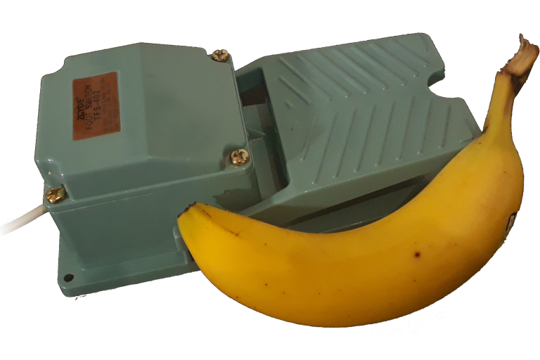

<p align="center">
  
</p>

`pedal` enables you to operate your computer via a foot pedal / foot switch.

In terms of hardware, a USB-to-serial converter was fitted in an industrial foot switch.
The switch connects the RX and TX pins of the converter.
Based on this, the software can derive intervals in which the switch was pressed.
And of course this is hacky.

The following modes are currently implemented:

- Command execution
- Toggle your microphone (`amixer` command based)
- Send a key press, e.g., for scrolling down
- Emulate a Morse Code keyboard


## Build the pedal

All you need is a USB-to-serial converter and a switch.
Connect the switch to the RX and TX pin of the converter and that's it.


## Build the software

Install [Go](https://golang.org/) in version 1.13 or later.

```sh
git clone https://github.com/oxzi/pedal
cd pedal

go build ./cmd/pedald
go build ./cmd/pedalcmd
```


## Usage

Connect the serial converter to your computer.
On a Linux based operating system, it should be available as `/dev/ttyUSB0` or the like.
For other operating systems you are on your own.

First, run `pedald` which will be the `pedal` daemon.

Afterwards, configure `pedald` with `pedalcmd`.

```sh
# Configure the USB-to-serial converter
pedalcmd input /dev/ttyUSB0

# Configure the operation mode
pedalcmd mode mic-toggle
pedalcmd mode morse-keyboard
```


## License

GNU GPLv3 or later.
